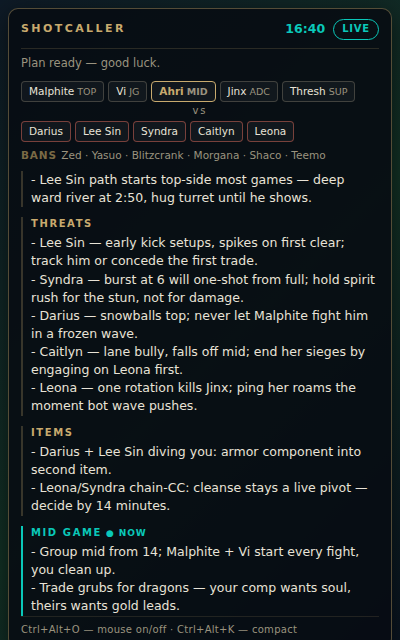
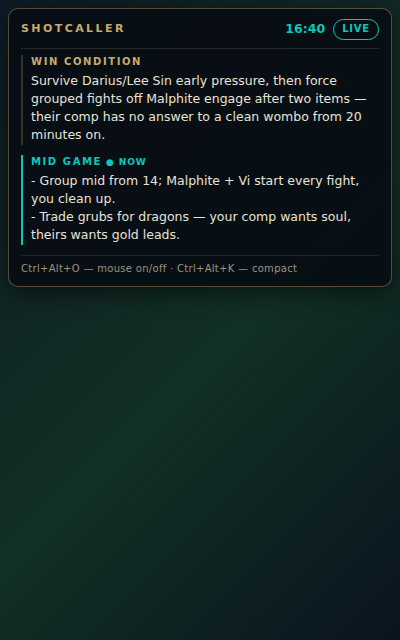

# Shotcaller

League of Legends lobby scanner + AI game-plan overlay.

Shotcaller watches your League client, reads champ select and the loading
screen through Riot's local APIs, and streams a Claude-generated game plan
into a transparent always-on-top overlay — win condition, lane plan, threat
list with power spikes, item pivots, and phase-by-phase macro that follows
the game clock.

<p>
  
  
</p>

## Why it's fast enough

The historic failure mode for tools like this is trying to OCR the screen or
scrape the web after picks lock. Shotcaller doesn't:

| Moment | What happens | Latency |
| --- | --- | --- |
| Champ select | LCU WebSocket pushes every pick/ban; overlay shows your lobby live | ~0 |
| All five allies lock | **Stage 1**: ally-side brief starts streaming (comp identity, your job) | seconds |
| Loading screen starts | LCU gameflow session reveals all ten champions | ~100 ms |
| +1–2 s | **Stage 2**: full plan streams into the overlay, token by token | first words |
| +10–15 s | Complete plan rendered | done |

In ranked, enemy picks are hidden until the loading screen *by design* — so
the loading screen (30–60 s) plus the 1:05 before minions spawn is the real
window, and the plan lands with most of it to spare. Both stages share a
prompt-cached coaching rubric (1 h TTL), so the time-critical call starts
from a warm cache.

## Quick start (Windows, on your gaming PC)

```
git clone <this repo> && cd lol-shotcaller
npm install
copy .env.example .env    # then put your ANTHROPIC_API_KEY in .env
npm start
```

- Get an API key at <https://console.anthropic.com>. A full game plan costs
  on the order of a few cents (default model `claude-opus-5`; see tuning).
- **League must run in Borderless (or Windowed) display mode** — true
  Fullscreen hides every overlay, Discord's included.
- Start Shotcaller whenever; it waits for the League client, reconnects if
  the client restarts, and picks up mid-game if you launch it late.

### Hotkeys

| Keys | Action |
| --- | --- |
| `Ctrl+Alt+O` | Toggle mouse interaction (overlay is click-through by default; interactive mode lets you scroll/drag it) |
| `Ctrl+Alt+K` | Compact mode: only the win condition + the section the game clock points at |

Override with `SHOTCALLER_HOTKEY_MOUSE` / `SHOTCALLER_HOTKEY_COLLAPSE` in `.env`.

### Tuning

| Env var | Default | Notes |
| --- | --- | --- |
| `ANTHROPIC_API_KEY` | — | Required for real plans; without it you get canned dry-run text |
| `SHOTCALLER_MODEL` | `claude-opus-5` | `claude-haiku-4-5` is the cheap/fast option if you want plans in ~5 s |
| `SHOTCALLER_EFFORT` | `low` | `low`/`medium`/`high` — reasoning depth vs. latency |
| `SHOTCALLER_MAX_PLAN_TOKENS` | `4000` | Response cap for the stage-2 call |

## Developing without League running

- `npm run start:mock` — replays a recorded ranked session (champ select →
  loading → in-game clock) through the real pipeline with canned plan text.
- `npm run demo` — opens the overlay with a fully rendered example plan, for
  UI iteration.
- `npm run simulate` — the same end-to-end pipeline, headless in a terminal
  (CI runs this). Add `SHOTCALLER_SIMULATE_LIVE=1` with an API key to make
  real planner calls and iterate on the prompt.
- `npm test` / `npm run typecheck` — unit tests and types.

## Personal coaching profile

Shotcaller is not a generic tips app: it coaches **against your actual
leaks**. `coach/profile.json` holds a diagnosis of the player's long-term
tendencies (produced by a multi-agent analysis of their public ranked
history — the readable version lives in `coach/diagnosis.md`). When the file
exists:

- every plan section is steered by the profile's standing *plan directives*
  (e.g. how to plan "if behind" for a player who historically forces plays
  when tilted), and
- stage-2 plans gain a final **`## FOCUS`** section — the 2–3 profile leaks
  *this* matchup is most likely to trigger, each tied to a concrete in-game
  moment. FOCUS stays pinned in the overlay's compact mode.

The profile lives in the user message (not the cached rubric), so editing it
never costs cache latency. Point `SHOTCALLER_PROFILE` at a different file to
swap profiles. Delete the file to fall back to generic coaching. Regenerate
it after a meaningful number of new games — it describes the player, not the
patch.

## Is this allowed?

Yes — this is the same integration surface the big companion apps
(Blitz, Porofessor, Mobalytics) are built on:

- **LCU API** (local client REST/WebSocket): read-only here; Riot tolerates
  it and asks developers to [register before public release](https://www.riotgames.com/en/DevRel/changes-to-the-lcu-api-policy).
- **Live Client Data API** (`https://127.0.0.1:2999`): [officially documented](https://developer.riotgames.com/docs/lol)
  by Riot for exactly this use.
- **Data Dragon**: Riot's official static-data CDN.
- The overlay is a separate transparent window — no injection, no memory
  reads, no input automation, which is what [Vanguard actually polices](https://www.riotgames.com/en/DevRel/vanguard-faq).
- Riot's line on features (per their [third-party app policy](https://support-leagueoflegends.riotgames.com/hc/en-us/articles/38353478786067-Third-Party-Applications)):
  nothing that reveals hidden information or "draws conclusions for you
  during gameplay" (e.g. the March 2025 ban on enemy-ult timers). Shotcaller
  stays on the safe side: pre-game planning plus a passive cheat sheet; the
  only live signal it reads is the game clock.

## Architecture

```
League client ──lockfile/WSS──▶ LcuConnector ──▶ Shotcaller (state machine)
                                                   │   fires stage 1 at pick lock,
Game process ──:2999 clock────▶ LiveClientPoller ──┤   stage 2 at loading screen
                                                   ▼
Data Dragon (cached) ──names──▶ prompt builder ──▶ Claude (streaming, cached rubric)
                                                   │
                       Electron overlay ◀──events──┘
```

- `src/planner/state.ts` — the state machine; all timing decisions live here
- `src/planner/prompt.ts` — the coaching rubric (cache-stable) + per-game messages
- `src/planner/claude.ts` — streaming planner, refusal fallback, dry-run twin
- `src/lcu/connector.ts` — league-connect wiring, reconnects, roster retries
- `src/lcu/mock.ts` + `fixtures/` — recorded session replay
- `src/overlay/` — the renderer (plain HTML/CSS/JS, no build step)

## Roadmap

- Scouting: enemy ranks/mains via the Riot Web API (needs an API key + daily
  dev-key refresh, so it's opt-in)
- Persist overlay position; per-role layout presets
- Package as an installer (electron-builder) instead of `npm start`
- Optional patch-notes feed into the rubric

## Troubleshooting

- **Overlay invisible in game** → switch League to Borderless in Settings →
  Video. If the card renders black, try `app.disableHardwareAcceleration()`
  (known Electron transparency quirk on some GPUs).
- **"Waiting for the League client…" forever** → make sure the League
  *client* (not just Riot Client) is running; Shotcaller reads its lockfile.
- **Plans feel slow** → set `SHOTCALLER_MODEL=claude-haiku-4-5`, keep
  `SHOTCALLER_EFFORT=low`.
- **No plan, status shows an API error** → check `ANTHROPIC_API_KEY` in
  `.env`; the terminal window logs the underlying error.
